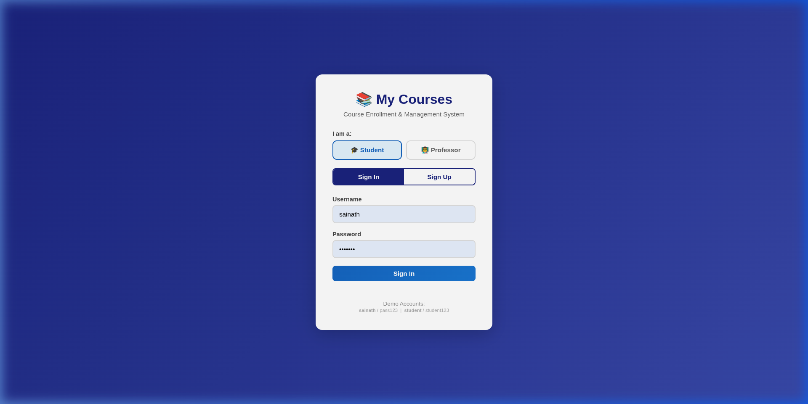
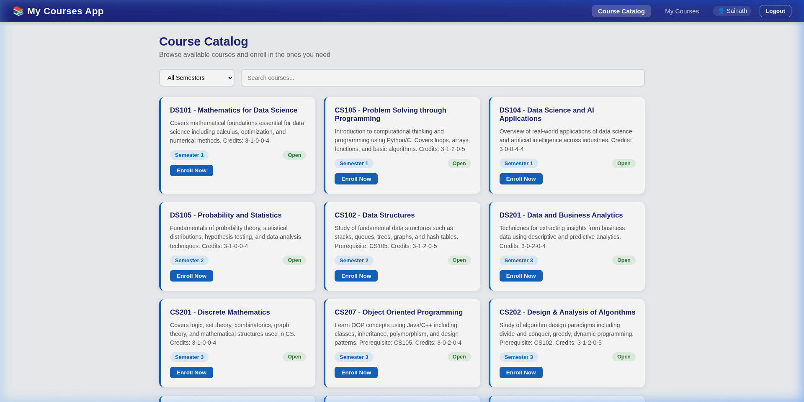
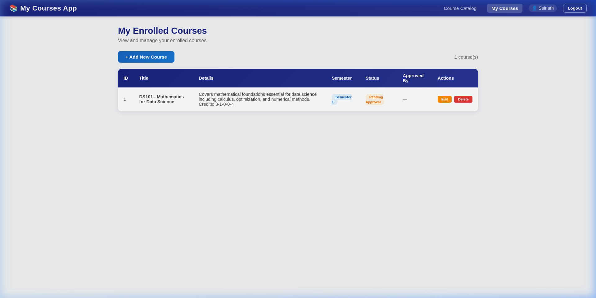
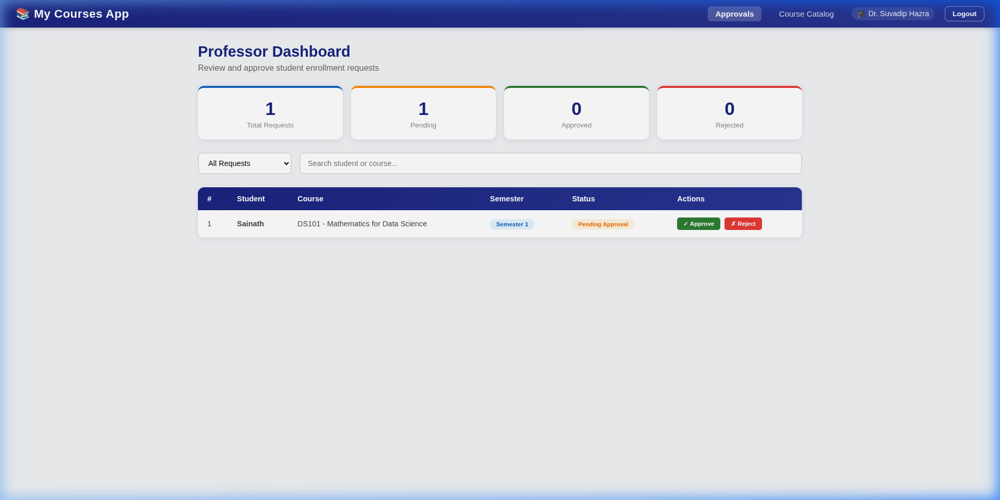

# My Courses App - Final Project

A cloud-native web application for managing course enrollment, built with Node.js, Express, HTML, CSS, and JavaScript.

## Features
- **User Authentication** - Sign In and Sign Up for Students and Professors
- **Role-Based Access** - Student and Professor portals with different dashboards
- **Course Catalog** - Browse 25+ courses from the IIIT Dharwad curriculum
- **My Courses (CRUD)** - Add, view, edit, and delete enrolled courses
- **Professor Approval** - Professors can approve or reject student enrollment requests
- **Session Management** - Enrolled courses stored in session
- **Responsive Design** - Works on desktop and mobile

## Tech Stack
- **Backend:** Node.js + Express.js
- **Frontend:** HTML, CSS, JavaScript
- **Session:** express-session
- **Deployment:** IBM Cloud Foundry

## How to Run Locally

```bash
# install dependencies
npm install

# start the server
node app.js
```

Then open http://localhost:8080 in your browser.

## Login Credentials

### Students
| Username | Password |
|----------|----------|
| sainath   | pass123  |
| student  | student123 |

### Professors
| Username | Password |
|----------|----------|
| prof1    | prof123  |
| admin    | admin123 |

## REST API Endpoints

| Method | Endpoint | Description |
|--------|----------|-------------|
| POST   | /login   | Authenticate user |
| POST   | /register | Create new account (student/professor) |
| POST   | /logout  | End session |
| GET    | /session | Check login status |
| GET    | /courses | Get all catalog courses |
| GET    | /course/:id | Get a single course |
| POST   | /course  | Add/enroll in a course |
| PUT    | /course/:id | Edit an enrolled course |
| DELETE | /course/:id | Remove a course |
| GET    | /mycourses | Get student's enrolled courses |
| GET    | /all-enrollments | Professor: view all enrollments |
| PUT    | /approve/:id | Professor: approve enrollment |
| PUT    | /reject/:id | Professor: reject enrollment |

## Project Structure
```
MyCourses/
├── app.js              # Express server + REST APIs
├── package.json        # Dependencies
├── manifest.yml        # IBM Cloud config
├── data/
│   └── courses.json    # Course catalog (25 courses)
├── public/
│   ├── login.html      # Login/Signup page (role selector)
│   ├── catalog.html    # Browse courses
│   ├── mycourses.html  # Manage enrolled courses
│   ├── professor.html  # Professor approval dashboard
│   ├── css/
│   │   └── style.css   # Stylesheet
│   └── js/
│       ├── login.js    # Login logic
│       ├── catalog.js  # Catalog + enrollment
│       └── mycourses.js # CRUD operations
├── screenshots/        # App screenshots for submission
└── README.md
```

## Screenshots

### Login Page (Role Selector + Sign In / Sign Up)


### Course Catalog


### My Courses (Pending Approval)


### Professor Dashboard (Approve / Reject)


## Deploying to IBM Cloud
```bash
ibmcloud cf push
```
